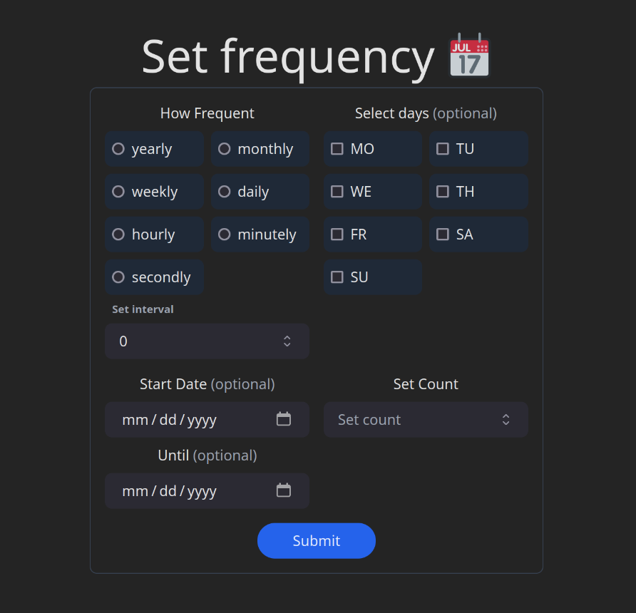

# 🔄 Awesome Recurring Event Creator 🗓️

## 🌟 Welcome to the coolest way to schedule your life! 🎉

Are you tired of boring, repetitive scheduling? Say hello to our Awesome Recurring Event Creator! 🥳

### 🚀 What does it do?

This React component lets you create super flexible recurring events with just a few clicks! Whether you're planning your workout routine 🏋️‍♀️, setting up team meetings 👥, or scheduling your daily meditation 🧘‍♂️, we've got you covered!

### 🛠️ Built with:

- React ⚛️
- RRule 📅
- TypeScript 📘
- Tailwind CSS 🎨

### 🔥 Features:

- 🔢 Set frequency (daily, weekly, monthly, you name it!)
- 🔁 Choose interval (every 2 days? 3 weeks? No problem!)
- 📆 Pick specific days of the week
- 📅 Set start and end dates
- 🔢 Limit by count or end date

### 🏃‍♂️ How to use:

1. Clone this repo 📋
2. Install dependencies with `npm install` 📦
3. Run `npm start` to launch the app 🚀
4. Start scheduling like a boss! 😎

### 👀 Preview

### 🤝 Contribute

Got ideas? We love ideas! Feel free to fork, create a branch, and submit a PR. Let's make scheduling fun together! 🤜🤛

### 📜 License

MIT License (because sharing is caring! ❤️)

---

Remember: Time is precious, so let's schedule it awesomely! ⏰✨
